# EJERCICIO ANÁLISIS DE DATOS ESPACIALES
## Correlación Espacial

### Análisis de Caso

Se tienen las bases de datos de la policía nacional sobre los crímenes varios, este ejercicio consiste en identificar si existe correlación espacial en los datos asociados a violencia intrafamiliar teniendo en cuenta la frecuencia municipal

En primer lugar, vamos a preparar nuestra área de trabajo asegurándonos de no tener otros objetos, para ello usamos la línea _rm(list=ls(all=TRUE))_.

Acto seguido, vamos a cargar las librerías (en un ejercicio anterior se expuso para qué se emplea cada una de ellas)


```R
library(maps)
library(maptools)
library(sp)
library(spdep)
library(gstat)
library(splancs)
library(spatstat)
library(pgirmess)
library(RColorBrewer)
library(classInt)
```

    Loading required package: sp
    Checking rgeos availability: TRUE
    Loading required package: Matrix
    
    Spatial Point Pattern Analysis Code in S-Plus
     
     Version 2 - Spatial and Space-Time analysis
    
    Loading required package: nlme
    Loading required package: rpart
    
    spatstat 1.52-1       (nickname: 'Apophenia') 
    For an introduction to spatstat, type 'beginner' 
    
    
    Note: spatstat version 1.52-1 is out of date by more than 8 months; we recommend upgrading to the latest version.
    
    Attaching package: 'spatstat'
    
    The following object is masked from 'package:gstat':
    
        idw
    
    

Vamos a cargar, ahora, los polígonos espaciales. Dentro del directorio de trabajo tenemos una carpeta llamada _mpio_ y dentro de ella tenemos nuestra base de datos para la construcción de los polígonos:


```R
map <- readShapePoly("mpio/mpio")
```

    Warning message:
    "use rgdal::readOGR or sf::st_read"

Vamos a mirar las características del archivo y a graficar para verificar que se trate del sistema que vamos a evaluar:


```R
summary(map); plot(map)
```


    Object of class SpatialPolygonsDataFrame
    Coordinates:
            min     max
    x 165298.36 1804280
    y  20565.69 1984871
    Is projected: NA 
    proj4string : [NA]
    Data attributes:
          AREA             PERIMETER         WCOLGEN02_       WCOLGEN021    
     Min.   :1.293e+06   Min.   :   5956   Min.   :   2.0   Min.   :   1.0  
     1st Qu.:1.349e+08   1st Qu.:  53160   1st Qu.: 282.2   1st Qu.: 278.2  
     Median :2.922e+08   Median :  83907   Median : 562.5   Median : 540.5  
     Mean   :1.020e+09   Mean   : 123867   Mean   : 562.5   Mean   : 544.4  
     3rd Qu.:7.027e+08   3rd Qu.: 137054   3rd Qu.: 842.8   3rd Qu.: 814.8  
     Max.   :6.579e+10   Max.   :1657909   Max.   :1123.0   Max.   :1093.0  
                                                                            
          DPTO            NOMBRE_DPT       MPIO           NOMBRE_MPI  
     05     :125   ANTIOQUIA   :125   001    :  33   BUENAVISTA:   4  
     15     :123   BOYACA      :123   250    :   8   LA UNION  :   4  
     25     :117   CUNDINAMARCA:117   318    :   7   VILLANUEVA:   4  
     68     : 87   SANTANDER   : 87   400    :   7   ALBANIA   :   3  
     52     : 64   NARIÑO      : 64   660    :   7   ARGELIA   :   3  
     73     : 47   TOLIMA      : 47   245    :   6   BOLIVAR   :   3  
     (Other):559   (Other)     :559   (Other):1054   (Other)   :1101  
          NOMBRE_CAB   CLASEMUN      MPIOS           ZONA       OF_REG   
     BUENAVISTA:   4   CD:  20   19809  :   2   ZONA06 :129   DABAR:152  
     LA UNION  :   4   CM:1102   25839  :   2   ZONA02 :122   DABOG:371  
     VILLANUEVA:   4             05001  :   1   ZONA04 :122   DACLI:163  
     ALBANIA   :   3             05002  :   1   ZONA07 :122   DALES:100  
     ARGELIA   :   3             05004  :   1   ZONA03 :120   DAMED:182  
     BOLIVAR   :   3             05021  :   1   ZONA05 :113   DANGA:154  
     (Other)   :1101             (Other):1114   (Other):394              
           REG_ZONAS      HECTARES      
     DABOGZONA09: 41   Min.   :    129  
     DABOGZONA06: 35   1st Qu.:  13491  
     DABOGZONA16: 34   Median :  29218  
     DABOGZONA03: 32   Mean   : 101995  
     DABOGZONA04: 31   3rd Qu.:  70266  
     DABARZONA07: 28   Max.   :6578661  
     (Other)    :921                    


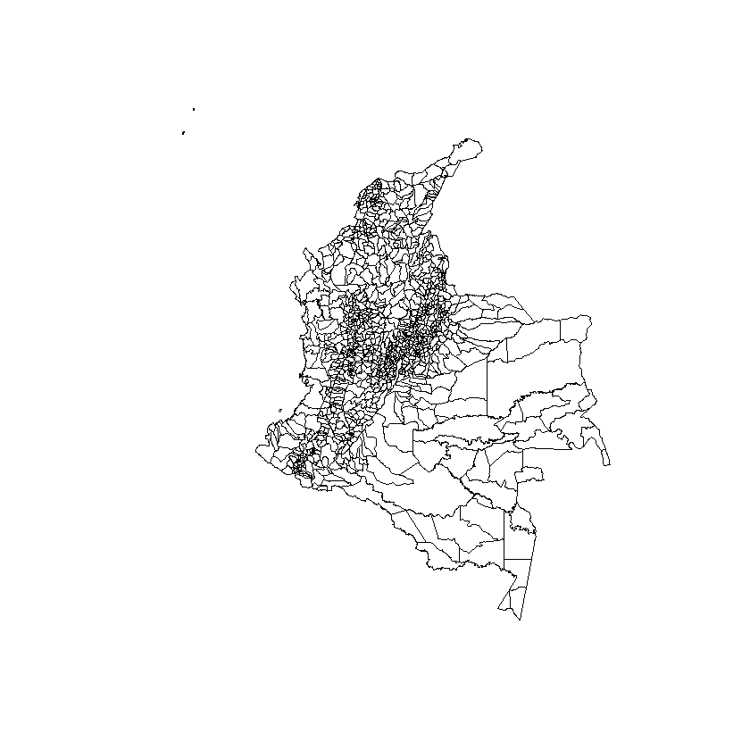


Efectivamente, se trata del sistema de polígonos que nos permite construir el mapa de Colombia; si embargo, com notanos en la linea _proj4string_ no existe aún asociación a un _GIS_. Vamos a asignarle uno:


```R
proj4string(map) <- CRS("+proj=utm +zone=17 +datum=WGS84")
summary(map)
```


    Object of class SpatialPolygonsDataFrame
    Coordinates:
            min     max
    x 165298.36 1804280
    y  20565.69 1984871
    Is projected: TRUE 
    proj4string :
    [+proj=utm +zone=17 +datum=WGS84 +ellps=WGS84 +towgs84=0,0,0]
    Data attributes:
          AREA             PERIMETER         WCOLGEN02_       WCOLGEN021    
     Min.   :1.293e+06   Min.   :   5956   Min.   :   2.0   Min.   :   1.0  
     1st Qu.:1.349e+08   1st Qu.:  53160   1st Qu.: 282.2   1st Qu.: 278.2  
     Median :2.922e+08   Median :  83907   Median : 562.5   Median : 540.5  
     Mean   :1.020e+09   Mean   : 123867   Mean   : 562.5   Mean   : 544.4  
     3rd Qu.:7.027e+08   3rd Qu.: 137054   3rd Qu.: 842.8   3rd Qu.: 814.8  
     Max.   :6.579e+10   Max.   :1657909   Max.   :1123.0   Max.   :1093.0  
                                                                            
          DPTO            NOMBRE_DPT       MPIO           NOMBRE_MPI  
     05     :125   ANTIOQUIA   :125   001    :  33   BUENAVISTA:   4  
     15     :123   BOYACA      :123   250    :   8   LA UNION  :   4  
     25     :117   CUNDINAMARCA:117   318    :   7   VILLANUEVA:   4  
     68     : 87   SANTANDER   : 87   400    :   7   ALBANIA   :   3  
     52     : 64   NARIÑO      : 64   660    :   7   ARGELIA   :   3  
     73     : 47   TOLIMA      : 47   245    :   6   BOLIVAR   :   3  
     (Other):559   (Other)     :559   (Other):1054   (Other)   :1101  
          NOMBRE_CAB   CLASEMUN      MPIOS           ZONA       OF_REG   
     BUENAVISTA:   4   CD:  20   19809  :   2   ZONA06 :129   DABAR:152  
     LA UNION  :   4   CM:1102   25839  :   2   ZONA02 :122   DABOG:371  
     VILLANUEVA:   4             05001  :   1   ZONA04 :122   DACLI:163  
     ALBANIA   :   3             05002  :   1   ZONA07 :122   DALES:100  
     ARGELIA   :   3             05004  :   1   ZONA03 :120   DAMED:182  
     BOLIVAR   :   3             05021  :   1   ZONA05 :113   DANGA:154  
     (Other)   :1101             (Other):1114   (Other):394              
           REG_ZONAS      HECTARES      
     DABOGZONA09: 41   Min.   :    129  
     DABOGZONA06: 35   1st Qu.:  13491  
     DABOGZONA16: 34   Median :  29218  
     DABOGZONA03: 32   Mean   : 101995  
     DABOGZONA04: 31   3rd Qu.:  70266  
     DABARZONA07: 28   Max.   :6578661  
     (Other)    :921                    


Ahora, vamos a traer los datos


```R
load('datos.RData'); ls()
```


<ol class=list-inline>
	<li>'datosVI'</li>
	<li>'df.viol'</li>
	<li>'map'</li>
	<li>'vio.intra.var'</li>
</ol>


Y, hagamos un resumen númerico de lo que acabamos de importar:


```R
summary(vio.intra.var)
```


          AÑO       DEPARTAMENTO          DEPTO              MPIOS          
     Min.   :2010   Length:282875      Length:282875      Length:282875     
     1st Qu.:2012   Class :character   Class :character   Class :character  
     Median :2014   Mode  :character   Mode  :character   Mode  :character  
     Mean   :2014                                                           
     3rd Qu.:2015                                                           
     Max.   :2016                                                           
                                                                            
         DIA            ARMA EMPLEADA           EDAD            SEXO          
     Length:282875      Length:282875      Min.   :  1.00   Length:282875     
     Class :character   Class :character   1st Qu.: 24.00   Class :character  
     Mode  :character   Mode  :character   Median : 31.00   Mode  :character  
                                           Mean   : 32.76                     
                                           3rd Qu.: 40.00                     
                                           Max.   :100.00                     
                                           NA's   :11855                      
     ESTADO CIVIL          CANTIDAD     
     Length:282875      Min.   : 1.000  
     Class :character   1st Qu.: 1.000  
     Mode  :character   Median : 1.000  
                        Mean   : 1.008  
                        3rd Qu.: 1.000  
                        Max.   :11.000  
                                        


Las variables _DEPTO_ y _MPIOS_ figuran como caracteres, vamos a convertirlas en factores para poder realizar algunos cálculos más adelante, podemos hacerlo también con varibles como _SEXO_, _ARMA EMPLEADA_ o _ESTADO CIVIL_ con el fin de calcular descriptivos; pero, vamos a obviar esta parte en el ejercicio:


```R
vio.intra.var$DEPTO<-factor(vio.intra.var$DEPTO)
vio.intra.var$MPIOS<-factor(vio.intra.var$MPIOS)
```

Un nuevo resumen numérico y podemos observar algunos cambios:


```R
summary(vio.intra.var)
head(vio.intra.var)
```


          AÑO       DEPARTAMENTO           DEPTO            MPIOS       
     Min.   :2010   Length:282875      11     : 40212   11001  : 40212  
     1st Qu.:2012   Class :character   76     : 39884   76001  : 23593  
     Median :2014   Mode  :character   68     : 28720   05001  : 12668  
     Mean   :2014                      05     : 25154   68001  : 10373  
     3rd Qu.:2015                      15     : 16265   50001  :  8237  
     Max.   :2016                      08     : 13618   08001  :  7686  
                                       (Other):119022   (Other):180106  
         DIA            ARMA EMPLEADA           EDAD            SEXO          
     Length:282875      Length:282875      Min.   :  1.00   Length:282875     
     Class :character   Class :character   1st Qu.: 24.00   Class :character  
     Mode  :character   Mode  :character   Median : 31.00   Mode  :character  
                                           Mean   : 32.76                     
                                           3rd Qu.: 40.00                     
                                           Max.   :100.00                     
                                           NA's   :11855                      
     ESTADO CIVIL          CANTIDAD     
     Length:282875      Min.   : 1.000  
     Class :character   1st Qu.: 1.000  
     Mode  :character   Median : 1.000  
                        Mean   : 1.008  
                        3rd Qu.: 1.000  
                        Max.   :11.000  
                                        


<table>
<thead><tr><th scope=col>AÑO</th><th scope=col>DEPARTAMENTO</th><th scope=col>DEPTO</th><th scope=col>MPIOS</th><th scope=col>DIA</th><th scope=col>ARMA EMPLEADA</th><th scope=col>EDAD</th><th scope=col>SEXO</th><th scope=col>ESTADO CIVIL</th><th scope=col>CANTIDAD</th></tr></thead>
<tbody>
	<tr><td>2010               </td><td>ANTIOQUIA          </td><td>05                 </td><td>05001              </td><td>Viernes            </td><td>SIN EMPLEO DE ARMAS</td><td>47                 </td><td>FEMENINO           </td><td>SOLTERO            </td><td>1                  </td></tr>
	<tr><td>2010               </td><td>ANTIOQUIA          </td><td>05                 </td><td>05001              </td><td>Viernes            </td><td>CONTUNDENTES       </td><td>45                 </td><td>FEMENINO           </td><td>UNION LIBRE        </td><td>1                  </td></tr>
	<tr><td>2010               </td><td>ANTIOQUIA          </td><td>05                 </td><td>05001              </td><td>Viernes            </td><td>CONTUNDENTES       </td><td>76                 </td><td>FEMENINO           </td><td>VIUDO              </td><td>1                  </td></tr>
	<tr><td>2010               </td><td>ANTIOQUIA          </td><td>05                 </td><td>05001              </td><td>Viernes            </td><td>CONTUNDENTES       </td><td>45                 </td><td>FEMENINO           </td><td>CASADO             </td><td>1                  </td></tr>
	<tr><td>2010               </td><td>ANTIOQUIA          </td><td>05                 </td><td>05001              </td><td>Viernes            </td><td>CONTUNDENTES       </td><td>36                 </td><td>MASCULINO          </td><td>SEPARADO           </td><td>1                  </td></tr>
	<tr><td>2010               </td><td>ANTIOQUIA          </td><td>05                 </td><td>05001              </td><td>Sábado             </td><td>CONTUNDENTES       </td><td>23                 </td><td>FEMENINO           </td><td>UNION LIBRE        </td><td>1                  </td></tr>
</tbody>
</table>


Como podemos ver, se trata de un conjunto de datos de panel. La sección _data_ del polígono espacial contiene datos de corte transversal por lo que, para efectos del ejercicio, vamos a calcular el acumulado por municipio, usando el respectivo _CÓDIGO_. De esta manera evitamos inconvenientes que pueda generar la escritura del nombre de las localidades:


```R
v.var<-aggregate(CANTIDAD~MPIOS, data = vio.intra.var, FUN = sum); summary(v.var)
```


         MPIOS         CANTIDAD      
     05001  :   1   Min.   :    1.0  
     05002  :   1   1st Qu.:   13.0  
     05004  :   1   Median :   30.0  
     05021  :   1   Mean   :  265.6  
     05030  :   1   3rd Qu.:   77.0  
     05031  :   1   Max.   :40867.0  
     (Other):1067                    


Veamos cómo queda la tabla:


```R
head(v.var)
```


<table>
<thead><tr><th scope=col>MPIOS</th><th scope=col>CANTIDAD</th></tr></thead>
<tbody>
	<tr><td>05001</td><td>13155</td></tr>
	<tr><td>05002</td><td>   23</td></tr>
	<tr><td>05004</td><td>    2</td></tr>
	<tr><td>05021</td><td>   13</td></tr>
	<tr><td>05030</td><td>  107</td></tr>
	<tr><td>05031</td><td>   77</td></tr>
</tbody>
</table>


Ahora, vamos a crear la matriz de pesos espaciales; para ello usamos la orden _poly2nb_ que facilita identificar las contigüidades y la orden _nb2listw_ que, en sí, construye la matriz de pesos espaciales (***W***)


```R
data<-map
map_crd <- coordinates(data)
W_cont_el <- poly2nb(data, queen=T)
W_cont_el_mat <- nb2listw(W_cont_el, style="W", zero.policy=TRUE)
```

Grafiquemos ahora las contigüidades:


```R
par(mar=rep(0,4))
plot(W_cont_el_mat,coords=map_crd,pch=19, cex=0.1, col="green")
```


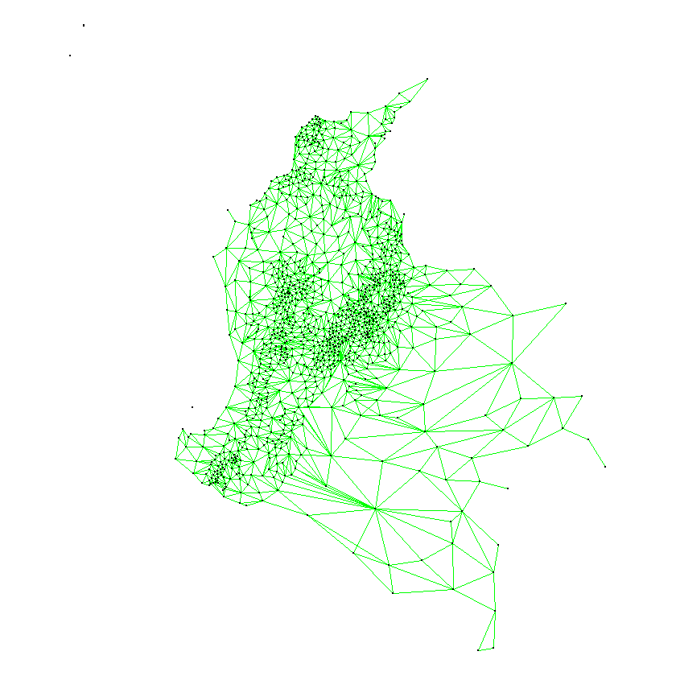


Si revisamos, hemos empleado la configuración _'queen = TRUE'_ lo que significa que una sola frontera compartida es suficiente para crear la contigüidad. El estudiante puede explorar que pasa si cambiamos esto a _FALSE_.

Ahora, debemos unir las tablas que tenemos para configurar una única base de datos dentro del polígono espacial. Para esto empleamos el comando *left_join* permite hacerlo usando como referencia la primera variable en común (desde la izquierda) que encuentre en ambas tablas:


```R
library(dplyr)
data@data <- left_join(data@data, v.var)
```

    
    Attaching package: 'dplyr'
    
    The following object is masked from 'package:nlme':
    
        collapse
    
    The following object is masked from 'package:splancs':
    
        tribble
    
    The following objects are masked from 'package:stats':
    
        filter, lag
    
    The following objects are masked from 'package:base':
    
        intersect, setdiff, setequal, union
    
    Joining, by = "MPIOS"
    Warning message:
    "Column `MPIOS` joining factors with different levels, coercing to character vector"

Como vemos, uso la variable _MPIOS_ para unir las tabla. Ahora, veamos eso en el mapa:


```R
library(tmap)
qtm(data, "CANTIDAD") 
```


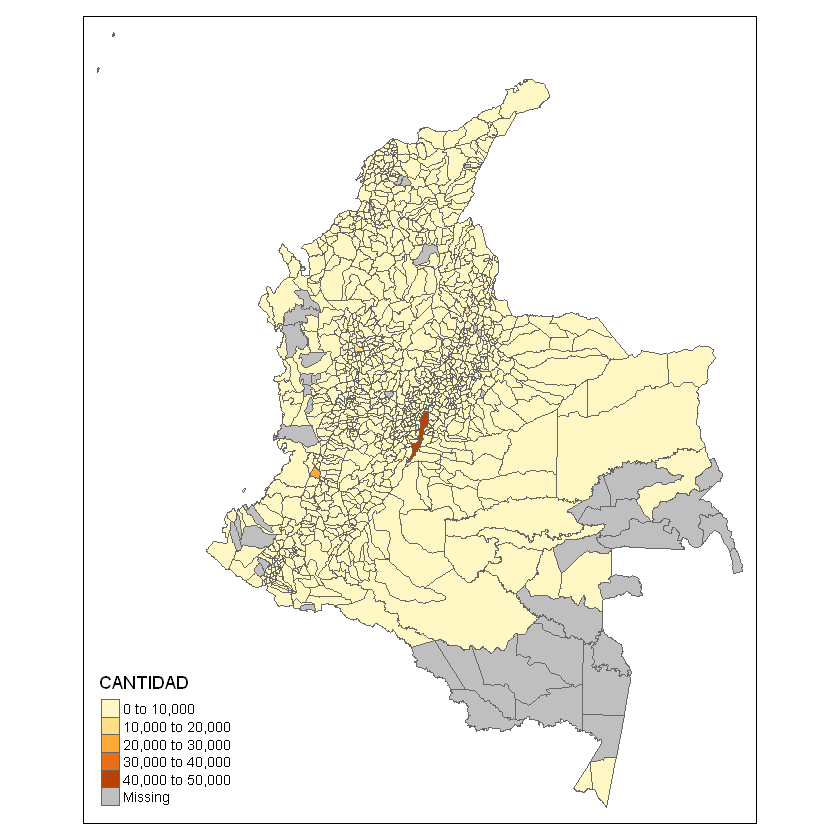


Observemos que los municipios donde no hubo registro se le dio tratamiento de _dato perdido_. También, podemos individualiar el departamento (hasta el municipio pero no tendría sentido hacerlo):


```R
qtm(data[data$DPTO=="27",], "CANTIDAD") 
```


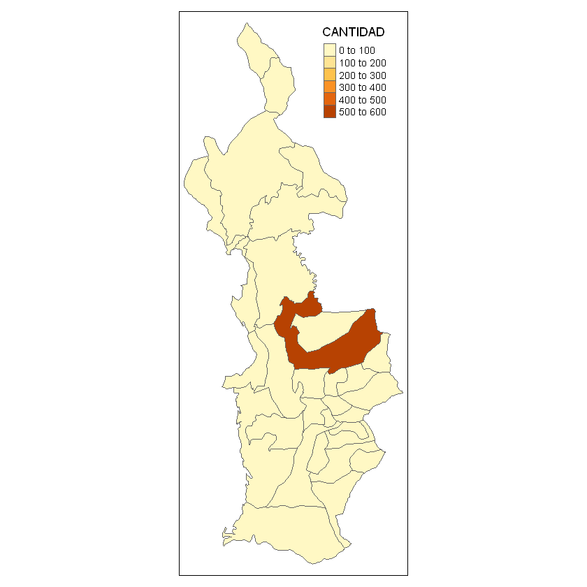


Vamos a asignar el valor *0* a la observación con dato ausente, esto con fines del ejercicio, pero se puede realizar el ejercicio de imputación de datos. Miremos ahora cómo nos queda el mapa:


```R
data@data[ is.na(data@data) ] <- 0
```


```R
qtm(data, "CANTIDAD") 
```


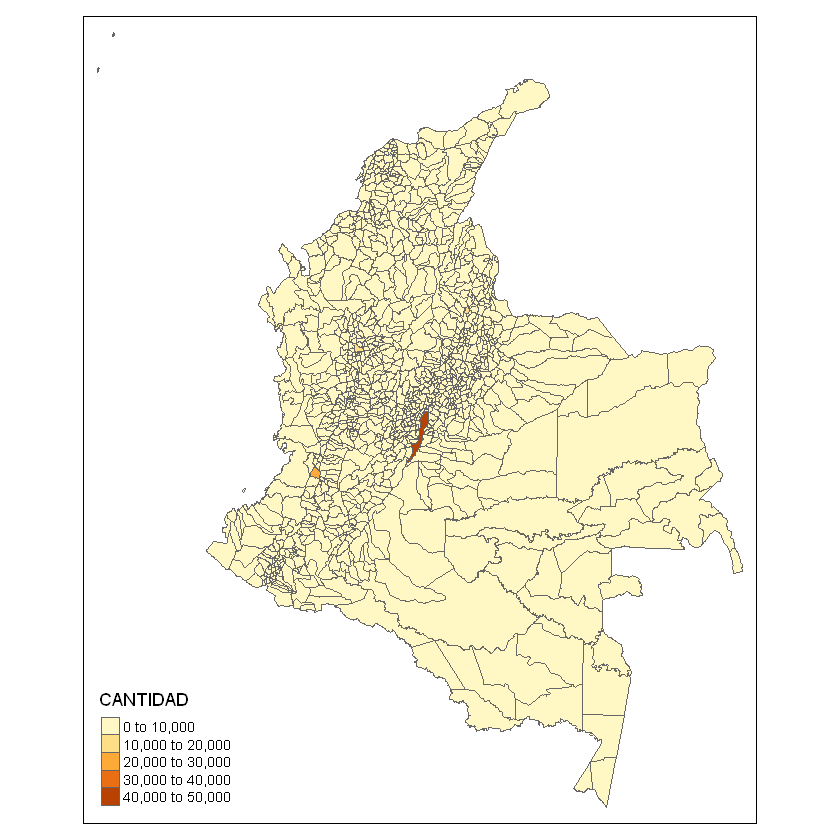


Con los _NA's_ reemplazados vamos a calcular los coeficientes de autocorrelación espacial:


```R
moran.test(data$CANTIDAD, listw=W_cont_el_mat, zero.policy=T)
```


    
    	Moran I test under randomisation
    
    data:  data$CANTIDAD  
    weights: W_cont_el_mat  
    
    Moran I statistic standard deviate = 1.7525, p-value = 0.03984
    alternative hypothesis: greater
    sample estimates:
    Moran I statistic       Expectation          Variance 
         0.0243128097     -0.0008952551      0.0002069012 
    


```R
geary.test(data$CANTIDAD, listw=W_cont_el_mat, zero.policy=T)
```


    
    	Geary C test under randomisation
    
    data:  data$CANTIDAD 
    weights: W_cont_el_mat 
    
    Geary C statistic standard deviate = -6.9134, p-value = 1
    alternative hypothesis: Expectation greater than statistic
    sample estimates:
    Geary C statistic       Expectation          Variance 
           1.80133937        1.00000000        0.01343524 
    


```R
data$VIOLE <- as.factor(ifelse(data$CANTIDAD < 100,1,0))
joincount.multi(data$VIOLE, listw=W_cont_el_mat, zero.policy=T)
```


<table>
<thead><tr><th></th><th scope=col>Joincount</th><th scope=col>Expected</th><th scope=col>Variance</th><th scope=col>z-value</th></tr></thead>
<tbody>
	<tr><th scope=row>0:0</th><td> 42.12398 </td><td> 22.16025 </td><td> 2.797256 </td><td>11.9364612</td></tr>
	<tr><th scope=row>1:1</th><td>360.59891 </td><td>361.37064 </td><td> 6.813523 </td><td>-0.2956499</td></tr>
	<tr><th scope=row>1:0</th><td>156.27711 </td><td>179.47807 </td><td>12.574343 </td><td>-6.5427940</td></tr>
	<tr><th scope=row>Jtot</th><td>156.27711 </td><td>179.47807 </td><td>13.078257 </td><td>-6.4155066</td></tr>
</tbody>
</table>


Veamos, ahora, la gráfica de dispersión para el coeficiente _I de Morán_:


```R
par(mar=c(4,4,1.5,0.5))
moran.plot(data$CANTIDAD, listw=W_cont_el_mat, zero.policy=T, xlim=c(0,45000),ylim=c(0,10000),
           pch=16, col="black",cex=.5, quiet=F, labels=as.character(data$NOMBRE_MPI),xlab="Violencia Intrafamiliar", 
           ylab="Violencia Intrafamiliar (Spatial Lag)", main="Moran Scatterplot")
```

    Potentially influential observations of
    	 lm(formula = wx ~ x) :
    
                           dfb.1_ dfb.x   dffit   cov.r   cook.d  hat    
    SANTA MARTA             0.00  -0.01   -0.01    1.01_*  0.00    0.00  
    BARRANQUILLA            0.00   0.07    0.07    1.02_*  0.00    0.02_*
    SOLEDAD                 0.02   0.10    0.11    1.01    0.01    0.01_*
    CARTAGENA              -0.01  -0.02   -0.03    1.01_*  0.00    0.01_*
    SINCELEJO              -0.01  -0.02   -0.02    1.01_*  0.00    0.00  
    CUCUTA                  0.00  -0.04   -0.04    1.02_*  0.00    0.01_*
    PUERTO SANTANDER        0.16  -0.02    0.16_*  0.95_*  0.01    0.00  
    BUCARAMANGA             0.00   0.10    0.10    1.04_*  0.01    0.04_*
    BARRANCABERMEJA         0.00   0.00    0.00    1.01_*  0.00    0.01  
    FLORIDABLANCA           0.05   0.22    0.24_*  0.99_*  0.03    0.01_*
    COPACABANA              0.07   0.00    0.07    0.99_*  0.00    0.00  
    BELLO                   0.07   0.05    0.09    0.99_*  0.00    0.00  
    MEDELLIN                0.00  -0.07   -0.07    1.06_*  0.00    0.06_*
    HELICONIA               0.08  -0.01    0.08    0.99_*  0.00    0.00  
    ITAGUI                  0.07   0.06    0.10    0.99_*  0.01    0.00  
    ENVIGADO                0.06   0.03    0.08    0.99_*  0.00    0.00  
    LA ESTRELLA             0.07   0.00    0.07    0.99_*  0.00    0.00  
    DUITAMA                -0.01  -0.02   -0.02    1.01_*  0.00    0.00  
    TUNJA                  -0.01  -0.03   -0.03    1.01_*  0.00    0.01_*
    SOPO                    0.15  -0.02    0.15_*  0.96_*  0.01    0.00  
    CHIA                    0.14   0.00    0.14_*  0.96_*  0.01    0.00  
    PEREIRA                 0.00  -0.02   -0.02    1.02_*  0.00    0.02_*
    COTA                    0.27  -0.03    0.27_*  0.88_*  0.03    0.00  
    SANTAFE DE BOGOTA D.C.  0.20  -1.79_* -1.79_*  2.25_*  1.59_*  0.56_*
    LA CALERA               0.14  -0.02    0.14_*  0.96_*  0.01    0.00  
    FUNZA                   0.21  -0.01    0.21_*  0.92_*  0.02    0.00  
    MOSQUERA                0.22   0.01    0.22_*  0.91_*  0.02    0.00  
    IBAGUE                 -0.01  -0.03   -0.03    1.01_*  0.00    0.01_*
    CHOACHI                 0.26  -0.04    0.26_*  0.88_*  0.03    0.00  
    SOACHA                  0.11   0.17    0.22_*  0.96_*  0.02    0.00  
    UBAQUE                  0.21  -0.03    0.21_*  0.92_*  0.02    0.00  
    CHIPAQUE                0.27  -0.04    0.27_*  0.88_*  0.03    0.00  
    UNE                     0.21  -0.03    0.21_*  0.92_*  0.02    0.00  
    PASCA                   0.22  -0.03    0.22_*  0.91_*  0.02    0.00  
    VILLAVICENCIO           0.00  -0.06   -0.06    1.02_*  0.00    0.02_*
    GUTIERREZ               0.17  -0.03    0.17_*  0.95_*  0.01    0.00  
    ARBELAEZ                0.17  -0.02    0.17_*  0.95_*  0.01    0.00  
    BUENAVENTURA            0.08   0.10    0.14_*  0.99_*  0.01    0.00  
    SAN BERNARDO            0.26  -0.04    0.26_*  0.88_*  0.03    0.00  
    VENECIA                 0.21  -0.03    0.21_*  0.92_*  0.02    0.00  
    GUAMAL                  0.17  -0.01    0.17_*  0.95_*  0.01    0.00  
    CABRERA                 0.17  -0.03    0.17_*  0.95_*  0.01    0.00  
    SAN LUIS DE CUBARRAL    0.11  -0.01    0.11    0.98_*  0.01    0.00  
    DAGUA                   0.10   0.01    0.10    0.98_*  0.01    0.00  
    COLOMBIA                0.11  -0.02    0.11    0.98_*  0.01    0.00  
    LA CUMBRE               0.12  -0.01    0.12    0.98_*  0.01    0.00  
    PALMIRA                 0.06   0.07    0.10    0.99_*  0.00    0.00  
    YUMBO                   0.10   0.02    0.11    0.98_*  0.01    0.00  
    CALI                    0.01  -0.12   -0.12    1.23_*  0.01    0.18_*
    CANDELARIA              0.10   0.01    0.10    0.98_*  0.01    0.00  
    JAMUNDI                 0.09   0.01    0.09    0.99_*  0.00    0.00  
    PUERTO TEJADA           0.07   0.00    0.07    0.99_*  0.00    0.00  
    NEIVA                  -0.01  -0.04   -0.05    1.01_*  0.00    0.01_*
    PASTO                  -0.01  -0.04   -0.04    1.01_*  0.00    0.01_*
    


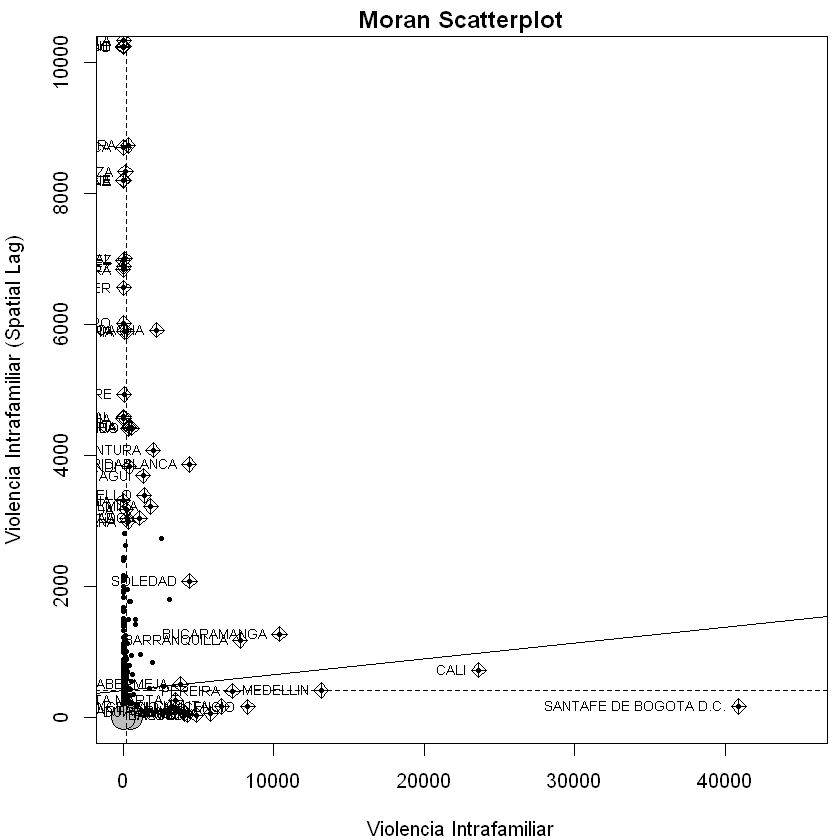


Lo anterior representa la autocorrelación global. Veamos ahora cómo está la autocorrelación local:


```R
lm1 <- localmoran(data$CANTIDAD, listw=W_cont_el_mat, zero.policy=T)
data$lm1 <- abs(lm1[,4]) ## Extract z-scores
lm.palette <- colorRampPalette(c("white","orange", "red"), space = "rgb")
spplot(data, zcol="lm1", col.regions=lm.palette(20), main="Local Moran's I (|z| scores)", pretty=T)
```


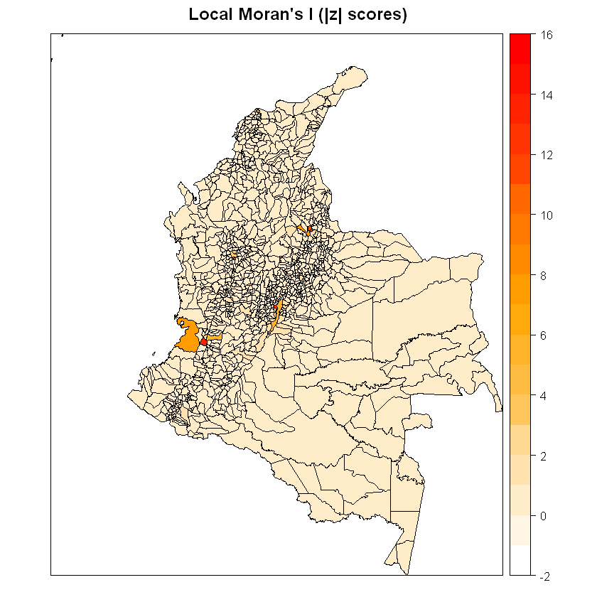


## Caso por Departamento

Vamos, ahora, a analizar la variable en un ámbito departamental. Para ello, vamos a importar los polígonos departamentales. El procedimiento que debemos seguir ahora es similar al realizado hasta el momento; por ello, vamos a obviar los comentarios en las lineas subsiguientes:


```R
mapd <- readShapePoly("Deptos/MGN_ADM_DPTO_POLITICO")
summary(mapd); plot(mapd)
```

    Warning message:
    "use rgdal::readOGR or sf::st_read"


    Object of class SpatialPolygonsDataFrame
    Coordinates:
            min       max
    x -81.73562 -66.84722
    y  -4.23285  13.39473
    Is projected: NA 
    proj4string : [NA]
    Data attributes:
       DPTO_CCDGO   DPTO_NANO_  
     05     : 1   Min.   :1538  
     08     : 1   1st Qu.:1905  
     11     : 1   Median :1959  
     13     : 1   Mean   :1932  
     15     : 1   3rd Qu.:1991  
     17     : 1   Max.   :1991  
     (Other):27                 
                                                          DPTO_CNMBR
     AMAZONAS                                                  : 1  
     ANTIOQUIA                                                 : 1  
     ARAUCA                                                    : 1  
     ARCHIPIÉLAGO DE SAN ANDRÉS, PROVIDENCIA Y SANTA CATALINA: 1  
     ATLÁNTICO                                                : 1  
     BOGOTÁ, D.C.                                             : 1  
     (Other)                                                   :27  
                                          DPTO_CACTO   DPTO_NAREA      
     Constitucion Politica de 1886             : 5   Min.   :    49.4  
     5 de Julio Constitucion Politica de 1991  : 4   1st Qu.: 20619.7  
     Articulo 309 Constitucion Politica de 1991: 3   Median : 24139.4  
     11 de Abril de 1905                       : 1   Mean   : 34573.8  
     15 de junio de 1857                       : 1   3rd Qu.: 48188.4  
     1964                                      : 1   Max.   :109497.6  
     (Other)                                   :18                     
       DPTO_NANO      SHAPE_AREA         SHAPE_LEN      
     Min.   :2016   Min.   :0.004048   Min.   : 0.6736  
     1st Qu.:2016   1st Qu.:1.679491   1st Qu.: 9.5509  
     Median :2016   Median :1.965024   Median :12.6091  
     Mean   :2016   Mean   :2.813120   Mean   :12.7021  
     3rd Qu.:2016   3rd Qu.:3.939728   3rd Qu.:17.2926  
     Max.   :2016   Max.   :8.877540   Max.   :25.3659  
                                                        


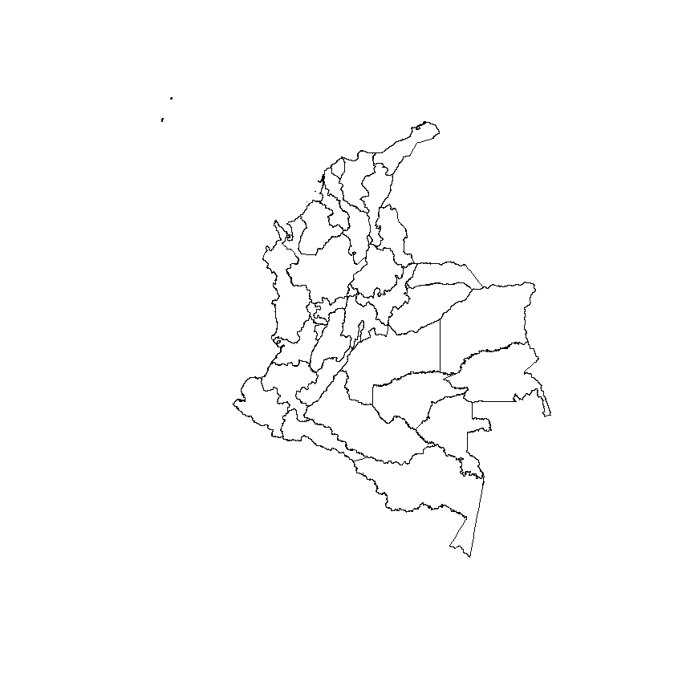


```R
proj4string(mapd) <- CRS("+proj=utm +zone=17 +datum=WGS84")
```


```R
summary(mapd)
```


    Object of class SpatialPolygonsDataFrame
    Coordinates:
            min       max
    x -81.73562 -66.84722
    y  -4.23285  13.39473
    Is projected: TRUE 
    proj4string :
    [+proj=utm +zone=17 +datum=WGS84 +ellps=WGS84 +towgs84=0,0,0]
    Data attributes:
       DPTO_CCDGO   DPTO_NANO_  
     05     : 1   Min.   :1538  
     08     : 1   1st Qu.:1905  
     11     : 1   Median :1959  
     13     : 1   Mean   :1932  
     15     : 1   3rd Qu.:1991  
     17     : 1   Max.   :1991  
     (Other):27                 
                                                          DPTO_CNMBR
     AMAZONAS                                                  : 1  
     ANTIOQUIA                                                 : 1  
     ARAUCA                                                    : 1  
     ARCHIPIÉLAGO DE SAN ANDRÉS, PROVIDENCIA Y SANTA CATALINA: 1  
     ATLÁNTICO                                                : 1  
     BOGOTÁ, D.C.                                             : 1  
     (Other)                                                   :27  
                                          DPTO_CACTO   DPTO_NAREA      
     Constitucion Politica de 1886             : 5   Min.   :    49.4  
     5 de Julio Constitucion Politica de 1991  : 4   1st Qu.: 20619.7  
     Articulo 309 Constitucion Politica de 1991: 3   Median : 24139.4  
     11 de Abril de 1905                       : 1   Mean   : 34573.8  
     15 de junio de 1857                       : 1   3rd Qu.: 48188.4  
     1964                                      : 1   Max.   :109497.6  
     (Other)                                   :18                     
       DPTO_NANO      SHAPE_AREA         SHAPE_LEN      
     Min.   :2016   Min.   :0.004048   Min.   : 0.6736  
     1st Qu.:2016   1st Qu.:1.679491   1st Qu.: 9.5509  
     Median :2016   Median :1.965024   Median :12.6091  
     Mean   :2016   Mean   :2.813120   Mean   :12.7021  
     3rd Qu.:2016   3rd Qu.:3.939728   3rd Qu.:17.2926  
     Max.   :2016   Max.   :8.877540   Max.   :25.3659  
                                                        


```R
summary(vio.intra.var)
```


          AÑO       DEPARTAMENTO           DEPTO            MPIOS       
     Min.   :2010   Length:282875      11     : 40212   11001  : 40212  
     1st Qu.:2012   Class :character   76     : 39884   76001  : 23593  
     Median :2014   Mode  :character   68     : 28720   05001  : 12668  
     Mean   :2014                      05     : 25154   68001  : 10373  
     3rd Qu.:2015                      15     : 16265   50001  :  8237  
     Max.   :2016                      08     : 13618   08001  :  7686  
                                       (Other):119022   (Other):180106  
         DIA            ARMA EMPLEADA           EDAD            SEXO          
     Length:282875      Length:282875      Min.   :  1.00   Length:282875     
     Class :character   Class :character   1st Qu.: 24.00   Class :character  
     Mode  :character   Mode  :character   Median : 31.00   Mode  :character  
                                           Mean   : 32.76                     
                                           3rd Qu.: 40.00                     
                                           Max.   :100.00                     
                                           NA's   :11855                      
     ESTADO CIVIL          CANTIDAD     
     Length:282875      Min.   : 1.000  
     Class :character   1st Qu.: 1.000  
     Mode  :character   Median : 1.000  
                        Mean   : 1.008  
                        3rd Qu.: 1.000  
                        Max.   :11.000  
                                        


```R
v.var.d<-aggregate(CANTIDAD~DEPTO, data = vio.intra.var, FUN = sum); summary(v.var.d)
```


         DEPTO       CANTIDAD    
     05     : 1   Min.   :   53  
     08     : 1   1st Qu.: 1958  
     11     : 1   Median : 5074  
     13     : 1   Mean   : 8637  
     15     : 1   3rd Qu.:10421  
     17     : 1   Max.   :40867  
     (Other):27                  


```R
head(v.var.d)
```


<table>
<thead><tr><th scope=col>DEPTO</th><th scope=col>CANTIDAD</th></tr></thead>
<tbody>
	<tr><td>05   </td><td>25673</td></tr>
	<tr><td>08   </td><td>13715</td></tr>
	<tr><td>11   </td><td>40867</td></tr>
	<tr><td>13   </td><td> 7509</td></tr>
	<tr><td>15   </td><td>16342</td></tr>
	<tr><td>17   </td><td> 4024</td></tr>
</tbody>
</table>


```R
datad<-mapd
map_crdd <- coordinates(datad)
W_cont_eld <- poly2nb(datad, queen=T)
W_cont_el_matd <- nb2listw(W_cont_eld, style="W", zero.policy=TRUE)
```


```R
par(mar=rep(0,4))
plot(W_cont_el_matd,coords=map_crdd,pch=19, cex=0.1, col="blue")
```


```R
summary(datad@data)
```


       DPTO_CCDGO   DPTO_NANO_  
     05     : 1   Min.   :1538  
     08     : 1   1st Qu.:1905  
     11     : 1   Median :1959  
     13     : 1   Mean   :1932  
     15     : 1   3rd Qu.:1991  
     17     : 1   Max.   :1991  
     (Other):27                 
                                                          DPTO_CNMBR
     AMAZONAS                                                  : 1  
     ANTIOQUIA                                                 : 1  
     ARAUCA                                                    : 1  
     ARCHIPIÉLAGO DE SAN ANDRÉS, PROVIDENCIA Y SANTA CATALINA: 1  
     ATLÁNTICO                                                : 1  
     BOGOTÁ, D.C.                                             : 1  
     (Other)                                                   :27  
                                          DPTO_CACTO   DPTO_NAREA      
     Constitucion Politica de 1886             : 5   Min.   :    49.4  
     5 de Julio Constitucion Politica de 1991  : 4   1st Qu.: 20619.7  
     Articulo 309 Constitucion Politica de 1991: 3   Median : 24139.4  
     11 de Abril de 1905                       : 1   Mean   : 34573.8  
     15 de junio de 1857                       : 1   3rd Qu.: 48188.4  
     1964                                      : 1   Max.   :109497.6  
     (Other)                                   :18                     
       DPTO_NANO      SHAPE_AREA         SHAPE_LEN      
     Min.   :2016   Min.   :0.004048   Min.   : 0.6736  
     1st Qu.:2016   1st Qu.:1.679491   1st Qu.: 9.5509  
     Median :2016   Median :1.965024   Median :12.6091  
     Mean   :2016   Mean   :2.813120   Mean   :12.7021  
     3rd Qu.:2016   3rd Qu.:3.939728   3rd Qu.:17.2926  
     Max.   :2016   Max.   :8.877540   Max.   :25.3659  
                                                        


```R
v.var.d$DPTO_CCDGO<-v.var.d$DEPTO
v.var.d$DEPTO<-NULL
summary(v.var.d)
```


        CANTIDAD       DPTO_CCDGO
     Min.   :   53   05     : 1  
     1st Qu.: 1958   08     : 1  
     Median : 5074   11     : 1  
     Mean   : 8637   13     : 1  
     3rd Qu.:10421   15     : 1  
     Max.   :40867   17     : 1  
                     (Other):27  


```R
datad@data <- left_join(datad@data, v.var.d)
```

    Joining, by = "DPTO_CCDGO"
    


```R
qtm(datad, "CANTIDAD") 
```


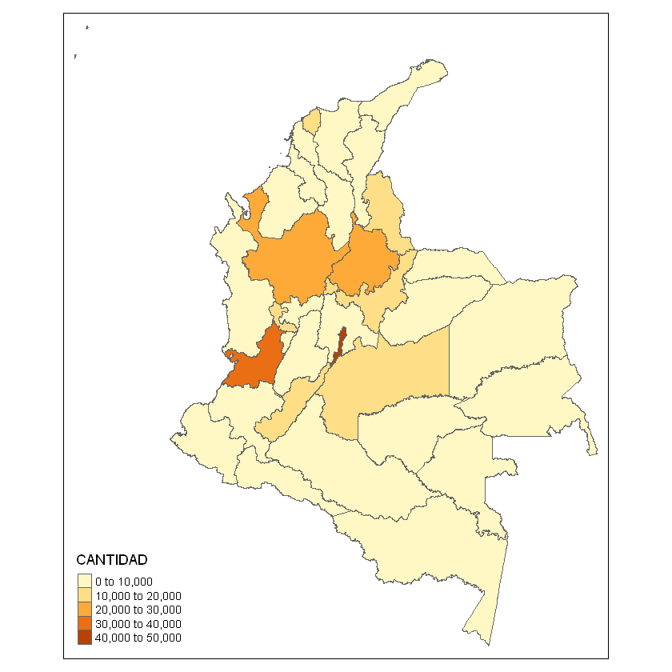


```R
moran.test(datad$CANTIDAD, listw=W_cont_el_matd, zero.policy=T)
```


    
    	Moran I test under randomisation
    
    data:  datad$CANTIDAD  
    weights: W_cont_el_matd  
    
    Moran I statistic standard deviate = 0.86962, p-value = 0.1923
    alternative hypothesis: greater
    sample estimates:
    Moran I statistic       Expectation          Variance 
           0.05993166       -0.03225806        0.01123832 
    


```R
geary.test(datad$CANTIDAD, listw=W_cont_el_matd, zero.policy=T)
```


    
    	Geary C test under randomisation
    
    data:  datad$CANTIDAD 
    weights: W_cont_el_matd 
    
    Geary C statistic standard deviate = 1.188, p-value = 0.1174
    alternative hypothesis: Expectation greater than statistic
    sample estimates:
    Geary C statistic       Expectation          Variance 
           0.84237287        1.00000000        0.01760341 
    


```R
datad$VIOLE <- as.factor(ifelse(datad$CANTIDAD < 10000,1,0))
joincount.multi(datad$VIOLE, listw=W_cont_el_matd, zero.policy=T)
```


<table>
<thead><tr><th></th><th scope=col>Joincount</th><th scope=col>Expected</th><th scope=col>Variance</th><th scope=col>z-value</th></tr></thead>
<tbody>
	<tr><th scope=row>0:0</th><td>2.051786  </td><td>1.451613  </td><td>0.1868215 </td><td> 1.3885545</td></tr>
	<tr><th scope=row>1:1</th><td>7.784524  </td><td>8.161290  </td><td>0.3128267 </td><td>-0.6736284</td></tr>
	<tr><th scope=row>1:0</th><td>6.163690  </td><td>7.419355  </td><td>0.6860945 </td><td>-1.5159386</td></tr>
	<tr><th scope=row>Jtot</th><td>6.163690  </td><td>7.419355  </td><td>0.9794993 </td><td>-1.2687367</td></tr>
</tbody>
</table>


```R
par(mar=c(4,4,1.5,0.5))
moran.plot(datad$CANTIDAD, listw=W_cont_el_matd, zero.policy=T, xlim=c(0,45000),ylim=c(0,10000),
           pch=16, col="black",cex=.5, quiet=F, labels=as.character(datad$DPTO_CNMBR),xlab="Violencia Intrafamiliar", 
           ylab="Violencia Intrafamiliar (Spatial Lag)", main="Moran Scatterplot")
```

    Potentially influential observations of
    	 lm(formula = wx ~ x) :
    
                    dfb.1_ dfb.x dffit   cov.r   cook.d hat    
    ANTIOQUIA        0.00   0.02  0.02    1.20_*  0.00   0.11  
    BOGOTÁ, D.C.    0.07  -0.19 -0.20    1.55_*  0.02   0.32_*
    CHOCÓ           0.81  -0.48  0.81_*  0.54_*  0.24   0.05  
    SANTANDER       -0.03   0.13  0.15    1.23_*  0.01   0.14  
    VALLE DEL CAUCA  0.30  -0.79 -0.83_*  1.37_*  0.34   0.30_*
    


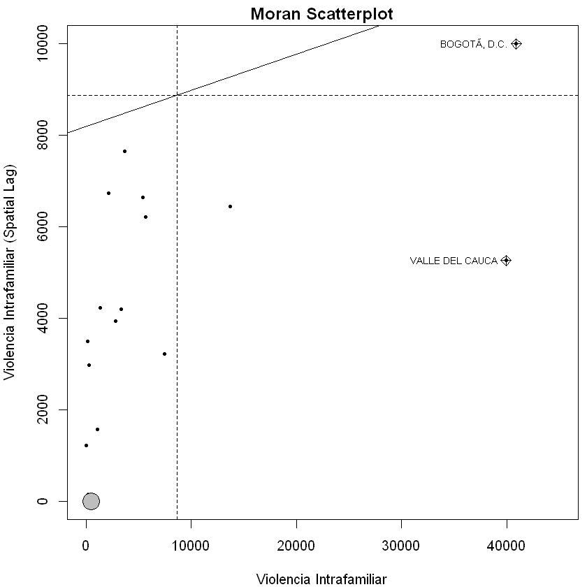


```R
lm1d <- localmoran(datad$CANTIDAD, listw=W_cont_el_matd, zero.policy=T); lm1d
```


<table>
<thead><tr><th></th><th scope=col>Ii</th><th scope=col>E.Ii</th><th scope=col>Var.Ii</th><th scope=col>Z.Ii</th><th scope=col>Pr(z &gt; 0)</th></tr></thead>
<tbody>
	<tr><th scope=row>0</th><td> 0.300519706</td><td>-0.03125    </td><td>0.10180852  </td><td> 1.03978766 </td><td>0.14921928  </td></tr>
	<tr><th scope=row>1</th><td>-0.101148869</td><td>-0.03125    </td><td>0.41242140  </td><td>-0.10884276 </td><td>0.54333640  </td></tr>
	<tr><th scope=row>2</th><td> 0.397725258</td><td>-0.03125    </td><td>0.26746872  </td><td> 0.82946056 </td><td>0.20342192  </td></tr>
	<tr><th scope=row>3</th><td>-0.038422625</td><td>-0.03125    </td><td>0.10180852  </td><td>-0.02247947 </td><td>0.50896726  </td></tr>
	<tr><th scope=row>4</th><td> 0.220044603</td><td>-0.03125    </td><td>0.08627788  </td><td> 0.85552643 </td><td>0.19612989  </td></tr>
	<tr><th scope=row>5</th><td>-0.215637845</td><td>-0.03125    </td><td>0.15150658  </td><td>-0.47371435 </td><td>0.68214819  </td></tr>
	<tr><th scope=row>6</th><td> 0.214560026</td><td>-0.03125    </td><td>0.10180852  </td><td> 0.77038448 </td><td>0.22053593  </td></tr>
	<tr><th scope=row>7</th><td>-0.094528804</td><td>-0.03125    </td><td>0.12251605  </td><td>-0.18078474 </td><td>0.57173173  </td></tr>
	<tr><th scope=row>8</th><td>-0.129522724</td><td>-0.03125    </td><td>0.15150658  </td><td>-0.25247434 </td><td>0.59966278  </td></tr>
	<tr><th scope=row>9</th><td>-0.145607508</td><td>-0.03125    </td><td>0.26746872  </td><td>-0.22112008 </td><td>0.58750053  </td></tr>
	<tr><th scope=row>10</th><td>-0.009403221</td><td>-0.03125    </td><td>0.10180852  </td><td> 0.06846921 </td><td>0.47270606  </td></tr>
	<tr><th scope=row>11</th><td>-1.211965312</td><td>-0.03125    </td><td>0.26746872  </td><td>-2.28301462 </td><td>0.98878525  </td></tr>
	<tr><th scope=row>12</th><td> 0.064535233</td><td>-0.03125    </td><td>0.12251605  </td><td> 0.27365417 </td><td>0.39217520  </td></tr>
	<tr><th scope=row>13</th><td> 0.248510593</td><td>-0.03125    </td><td>0.41242140  </td><td> 0.43562816 </td><td>0.33155327  </td></tr>
	<tr><th scope=row>14</th><td> 0.059181459</td><td>-0.03125    </td><td>0.19499239  </td><td> 0.20479093 </td><td>0.41886774  </td></tr>
	<tr><th scope=row>15</th><td> 0.041043908</td><td>-0.03125    </td><td>0.08627788  </td><td> 0.24612287 </td><td>0.40279356  </td></tr>
	<tr><th scope=row>16</th><td> 0.059234649</td><td>-0.03125    </td><td>0.41242140  </td><td> 0.14089783 </td><td>0.44397533  </td></tr>
	<tr><th scope=row>17</th><td> 0.107790036</td><td>-0.03125    </td><td>0.26746872  </td><td> 0.26884587 </td><td>0.39402415  </td></tr>
	<tr><th scope=row>18</th><td>-0.657307433</td><td>-0.03125    </td><td>0.26746872  </td><td>-1.21053590 </td><td>0.88696334  </td></tr>
	<tr><th scope=row>19</th><td> 0.122723002</td><td>-0.03125    </td><td>0.12251605  </td><td> 0.43989405 </td><td>0.33000692  </td></tr>
	<tr><th scope=row>20</th><td> 0.701389288</td><td>-0.03125    </td><td>0.15150658  </td><td> 1.88223763 </td><td>0.02990188  </td></tr>
	<tr><th scope=row>21</th><td> 0.065531717</td><td>-0.03125    </td><td>0.41242140  </td><td> 0.15070329 </td><td>0.44010489  </td></tr>
	<tr><th scope=row>22</th><td>-0.048557454</td><td>-0.03125    </td><td>0.10180852  </td><td>-0.05424268 </td><td>0.52162909  </td></tr>
	<tr><th scope=row>23</th><td>-0.960504910</td><td>-0.03125    </td><td>0.15150658  </td><td>-2.38736659 </td><td>0.99151522  </td></tr>
	<tr><th scope=row>24</th><td> 0.111731508</td><td>-0.03125    </td><td>0.26746872  </td><td> 0.27646705 </td><td>0.39109468  </td></tr>
	<tr><th scope=row>25</th><td> 0.044399732</td><td>-0.03125    </td><td>0.15150658  </td><td> 0.19435318 </td><td>0.42294968  </td></tr>
	<tr><th scope=row>26</th><td> 0.291481857</td><td>-0.03125    </td><td>0.19499239  </td><td> 0.73085801 </td><td>0.23243294  </td></tr>
	<tr><th scope=row>27</th><td> 0.000000000</td><td> 0.00000    </td><td>0.00000000  </td><td>        NaN </td><td>       NaN  </td></tr>
	<tr><th scope=row>28</th><td> 0.484485581</td><td>-0.03125    </td><td>0.26746872  </td><td> 0.99721911 </td><td>0.15932908  </td></tr>
	<tr><th scope=row>29</th><td> 0.649524944</td><td>-0.03125    </td><td>0.26746872  </td><td> 1.31633691 </td><td>0.09403049  </td></tr>
	<tr><th scope=row>30</th><td> 0.430917559</td><td>-0.03125    </td><td>0.15150658  </td><td> 1.18736353 </td><td>0.11754213  </td></tr>
	<tr><th scope=row>31</th><td> 0.579095990</td><td>-0.03125    </td><td>0.19499239  </td><td> 1.38218848 </td><td>0.08345692  </td></tr>
	<tr><th scope=row>32</th><td> 0.395924987</td><td>-0.03125    </td><td>0.15150658  </td><td> 1.09746344 </td><td>0.13621943  </td></tr>
</tbody>
</table>


```R
datad$lm1d <- abs(lm1d[,4]) ## Extract z-scores
lm.palette <- colorRampPalette(c("white","orange", "red"), space = "rgb")
spplot(datad, zcol="lm1d", col.regions=lm.palette(20), main="Local Moran's I (|z| scores)", pretty=T)
```


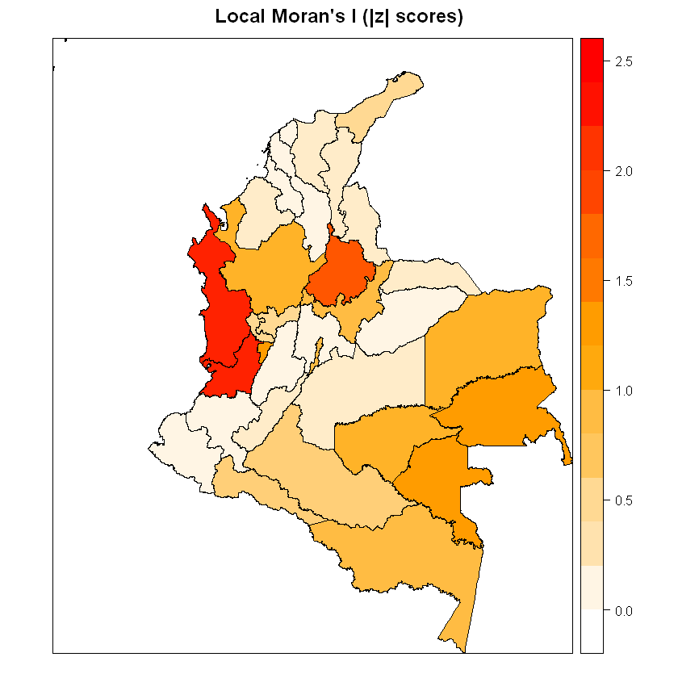


```R
datad@data; v.var.d
```


<table>
<thead><tr><th scope=col>DPTO_CCDGO</th><th scope=col>DPTO_NANO_</th><th scope=col>DPTO_CNMBR</th><th scope=col>DPTO_CACTO</th><th scope=col>DPTO_NAREA</th><th scope=col>DPTO_NANO</th><th scope=col>SHAPE_AREA</th><th scope=col>SHAPE_LEN</th><th scope=col>CANTIDAD</th><th scope=col>VIOLE</th><th scope=col>lm1d</th></tr></thead>
<tbody>
	<tr><td>05                                                          </td><td>1886                                                        </td><td>ANTIOQUIA                                                   </td><td>Constitucion Politica de 1886                               </td><td> 62967.72160                                                </td><td>2016                                                        </td><td>5.134915319                                                 </td><td>21.4437686                                                  </td><td>25673                                                       </td><td>0                                                           </td><td>1.03978766                                                  </td></tr>
	<tr><td>08                                                          </td><td>1910                                                        </td><td>ATLÁNTICO                                                  </td><td>Ley 21 de 1910                                              </td><td>  3315.75168                                                </td><td>2016                                                        </td><td>0.273930384                                                 </td><td> 2.5407656                                                  </td><td>13715                                                       </td><td>0                                                           </td><td>0.10884276                                                  </td></tr>
	<tr><td>11                                                          </td><td>1538                                                        </td><td>BOGOTÁ, D.C.                                               </td><td>Constitucion Politica de 1886                               </td><td>  1622.73887                                                </td><td>2016                                                        </td><td>0.132207855                                                 </td><td> 3.7604796                                                  </td><td>40867                                                       </td><td>0                                                           </td><td>0.82946056                                                  </td></tr>
	<tr><td>13                                                          </td><td>1886                                                        </td><td>BOLÍVAR                                                    </td><td>Constitucion Politica de 1886                               </td><td> 26689.69063                                                </td><td>2016                                                        </td><td>2.195199944                                                 </td><td>15.7228286                                                  </td><td> 7509                                                       </td><td>1                                                           </td><td>0.02247947                                                  </td></tr>
	<tr><td>15                                                          </td><td>1886                                                        </td><td>BOYACÁ                                                     </td><td>Constitucion Politica de 1886                               </td><td> 23138.04813                                                </td><td>2016                                                        </td><td>1.888390832                                                 </td><td>15.9064914                                                  </td><td>16342                                                       </td><td>0                                                           </td><td>0.85552643                                                  </td></tr>
	<tr><td>17                                                          </td><td>1905                                                        </td><td>CALDAS                                                      </td><td>11 de Abril de 1905                                         </td><td>  7425.26978                                                </td><td>2016                                                        </td><td>0.605501726                                                 </td><td> 6.6563516                                                  </td><td> 4024                                                       </td><td>1                                                           </td><td>0.47371435                                                  </td></tr>
	<tr><td>18                                                          </td><td>1981                                                        </td><td>CAQUETÁ                                                    </td><td>Ley 78 del 29 de Diciembre de 1981                          </td><td> 90103.00817                                                </td><td>2016                                                        </td><td>7.318484692                                                 </td><td>21.3842868                                                  </td><td> 3320                                                       </td><td>1                                                           </td><td>0.77038448                                                  </td></tr>
	<tr><td>19                                                          </td><td>1857                                                        </td><td>CAUCA                                                       </td><td>15 de junio de 1857                                         </td><td> 31242.95125                                                </td><td>2016                                                        </td><td>2.534421782                                                 </td><td>13.9515651                                                  </td><td> 5074                                                       </td><td>1                                                           </td><td>0.18078474                                                  </td></tr>
	<tr><td>20                                                          </td><td>1967                                                        </td><td>CESAR                                                       </td><td>Ley 25  21 de junio de 1967                                 </td><td> 22562.35990                                                </td><td>2016                                                        </td><td>1.857961127                                                 </td><td>12.6090508                                                  </td><td> 2502                                                       </td><td>1                                                           </td><td>0.25247434                                                  </td></tr>
	<tr><td>23                                                          </td><td>1951                                                        </td><td>CÓRDOBA                                                    </td><td>Ley 9 del 18 de Diciembre de 1951                           </td><td> 25086.36804                                                </td><td>2016                                                        </td><td>2.057533510                                                 </td><td> 9.6915090                                                  </td><td> 4925                                                       </td><td>1                                                           </td><td>0.22112008                                                  </td></tr>
	<tr><td>25                                                          </td><td>1886                                                        </td><td>CUNDINAMARCA                                                </td><td>Constitucion Politica de 1886                               </td><td> 22370.57350                                                </td><td>2016                                                        </td><td>1.823629603                                                 </td><td>13.1195937                                                  </td><td> 8417                                                       </td><td>1                                                           </td><td>0.06846921                                                  </td></tr>
	<tr><td>27                                                          </td><td>1947                                                        </td><td>CHOCÓ                                                      </td><td>Ley 13 del 3 de Noviembre de 1947                           </td><td> 48188.35945                                                </td><td>2016                                                        </td><td>3.939728254                                                 </td><td>20.6334188                                                  </td><td>  843                                                       </td><td>1                                                           </td><td>2.28301462                                                  </td></tr>
	<tr><td>41                                                          </td><td>1905                                                        </td><td>HUILA                                                       </td><td>Ley 46 de 1905                                              </td><td> 18141.65581                                                </td><td>2016                                                        </td><td>1.474219178                                                 </td><td>10.3355601                                                  </td><td>10421                                                       </td><td>0                                                           </td><td>0.27365417                                                  </td></tr>
	<tr><td>44                                                          </td><td>1964                                                        </td><td>LA GUAJIRA                                                  </td><td>Acto Legislativo No. 1 de Diciembre 28 de 1964              </td><td> 20619.68703                                                </td><td>2016                                                        </td><td>1.707118371                                                 </td><td>10.8199870                                                  </td><td> 2817                                                       </td><td>1                                                           </td><td>0.43562816                                                  </td></tr>
	<tr><td>47                                                          </td><td>1964                                                        </td><td>MAGDALENA                                                   </td><td>1964                                                        </td><td> 23135.94012                                                </td><td>2016                                                        </td><td>1.909265151                                                 </td><td>10.8135914                                                  </td><td> 5387                                                       </td><td>1                                                           </td><td>0.20479093                                                  </td></tr>
	<tr><td>50                                                          </td><td>1959                                                        </td><td>META                                                        </td><td>Ley 118 del 16 de Diciembre de 1959                         </td><td> 85524.79263                                                </td><td>2016                                                        </td><td>6.955378036                                                 </td><td>18.2348737                                                  </td><td>11141                                                       </td><td>0                                                           </td><td>0.24612287                                                  </td></tr>
	<tr><td>52                                                          </td><td>1904                                                        </td><td>NARIÑO                                                     </td><td>Ley 1 de 1904                                               </td><td> 31497.35961                                                </td><td>2016                                                        </td><td>2.548463142                                                 </td><td>12.8222066                                                  </td><td> 7435                                                       </td><td>1                                                           </td><td>0.14089783                                                  </td></tr>
	<tr><td>54                                                          </td><td>1910                                                        </td><td>NORTE DE SANTANDER                                          </td><td>Ley 25 de 1910                                              </td><td> 21857.68557                                                </td><td>2016                                                        </td><td>1.792298982                                                 </td><td>10.6942805                                                  </td><td>10272                                                       </td><td>0                                                           </td><td>0.26884587                                                  </td></tr>
	<tr><td>63                                                          </td><td>1966                                                        </td><td>QUINDIO                                                     </td><td>Ley 2 TM de 1966                                            </td><td>  1933.57729                                                </td><td>2016                                                        </td><td>0.157423729                                                 </td><td> 2.5548255                                                  </td><td> 1958                                                       </td><td>1                                                           </td><td>1.21053590                                                  </td></tr>
	<tr><td>66                                                          </td><td>1966                                                        </td><td>RISARALDA                                                   </td><td>Ley 70 del 1 de Diciembre de 1966                           </td><td>  3556.77438                                                </td><td>2016                                                        </td><td>0.289790626                                                 </td><td> 4.8435872                                                  </td><td>11585                                                       </td><td>0                                                           </td><td>0.43989405                                                  </td></tr>
	<tr><td>68                                                          </td><td>1910                                                        </td><td>SANTANDER                                                   </td><td>Ley 25 14 de Julio de 1910                                  </td><td> 30561.50172                                                </td><td>2016                                                        </td><td>2.499104130                                                 </td><td>11.8785987                                                  </td><td>28800                                                       </td><td>0                                                           </td><td>1.88223763                                                  </td></tr>
	<tr><td>70                                                          </td><td>1966                                                        </td><td>SUCRE                                                       </td><td>Ley 47 del 8 de Agosto de 1966                              </td><td> 10591.94284                                                </td><td>2016                                                        </td><td>0.870810470                                                 </td><td> 8.5712204                                                  </td><td> 5661                                                       </td><td>1                                                           </td><td>0.15070329                                                  </td></tr>
	<tr><td>73                                                          </td><td>1909                                                        </td><td>TOLIMA                                                      </td><td>Ley 65 de Noviembre de 1909                                 </td><td> 24139.37178                                                </td><td>2016                                                        </td><td>1.965024455                                                 </td><td> 9.5508730                                                  </td><td> 6853                                                       </td><td>1                                                           </td><td>0.05424268                                                  </td></tr>
	<tr><td>76                                                          </td><td>1910                                                        </td><td>VALLE DEL CAUCA                                             </td><td>Decreto No 340 de 16 de Abril de 1910                       </td><td> 20664.53245                                                </td><td>2016                                                        </td><td>1.679490998                                                 </td><td>12.6267346                                                  </td><td>39918                                                       </td><td>0                                                           </td><td>2.38736659                                                  </td></tr>
	<tr><td>81                                                          </td><td>1991                                                        </td><td>ARAUCA                                                      </td><td>5 de Julio Constitucion Politica de 1991                    </td><td> 23851.40798                                                </td><td>2016                                                        </td><td>1.944167124                                                 </td><td> 9.1250889                                                  </td><td> 2172                                                       </td><td>1                                                           </td><td>0.27646705                                                  </td></tr>
	<tr><td>85                                                          </td><td>1991                                                        </td><td>CASANARE                                                    </td><td>5 de Julio Constitucion Politica de 1991                    </td><td> 44394.23977                                                </td><td>2016                                                        </td><td>3.615063148                                                 </td><td>12.1327536                                                  </td><td> 3703                                                       </td><td>1                                                           </td><td>0.19435318                                                  </td></tr>
	<tr><td>86                                                          </td><td>1991                                                        </td><td>PUTUMAYO                                                    </td><td>Articulo 309 Constitucion Politica de 1991                  </td><td> 25976.29069                                                </td><td>2016                                                        </td><td>2.107964833                                                 </td><td>12.7079225                                                  </td><td> 1368                                                       </td><td>1                                                           </td><td>0.73085801                                                  </td></tr>
	<tr><td>88                                                          </td><td>1991                                                        </td><td>ARCHIPIÉLAGO DE SAN ANDRÉS, PROVIDENCIA Y SANTA CATALINA  </td><td>Artículo 310 Constitucion Politica de 1991                 </td><td>    49.40207                                                </td><td>2016                                                        </td><td>0.004048093                                                 </td><td> 0.6735517                                                  </td><td>  522                                                       </td><td>1                                                           </td><td>       NaN                                                  </td></tr>
	<tr><td>91                                                          </td><td>1991                                                        </td><td>AMAZONAS                                                    </td><td>Dcto. 2274 del 4 de Octubre de la Constitución Política 19</td><td>109497.60694                                                </td><td>2016                                                        </td><td>8.877540123                                                 </td><td>25.3659123                                                  </td><td> 1092                                                       </td><td>1                                                           </td><td>0.99721911                                                  </td></tr>
	<tr><td>94                                                          </td><td>1991                                                        </td><td>GUAINÍA                                                    </td><td>Articulo 309 Constitucion Politica de 1991                  </td><td> 71289.27909                                                </td><td>2016                                                        </td><td>5.747937881                                                 </td><td>21.1790495                                                  </td><td>  214                                                       </td><td>1                                                           </td><td>1.31633691                                                  </td></tr>
	<tr><td>95                                                          </td><td>1991                                                        </td><td>GUAVIARE                                                    </td><td>5 de Julio Constitucion Politica de 1991                    </td><td> 55575.11849                                                </td><td>2016                                                        </td><td>4.511457244                                                 </td><td>19.3967890                                                  </td><td>  267                                                       </td><td>1                                                           </td><td>1.18736353                                                  </td></tr>
	<tr><td>97                                                          </td><td>1991                                                        </td><td>VAUPÉS                                                     </td><td>Articulo 309 Constitucion Politica de 1991                  </td><td> 53299.21019                                                </td><td>2016                                                        </td><td>4.313810177                                                 </td><td>20.1298338                                                  </td><td>   53                                                       </td><td>1                                                           </td><td>1.38218848                                                  </td></tr>
	<tr><td>99                                                          </td><td>1991                                                        </td><td>VICHADA                                                     </td><td>5 de Julio Constitucion Politica de 1991                    </td><td>100065.86487                                                </td><td>2016                                                        </td><td>8.100680490                                                 </td><td>17.2926130                                                  </td><td>  168                                                       </td><td>1                                                           </td><td>1.09746344                                                  </td></tr>
</tbody>
</table>


<table>
<thead><tr><th scope=col>CANTIDAD</th><th scope=col>DPTO_CCDGO</th></tr></thead>
<tbody>
	<tr><td>25673</td><td>05   </td></tr>
	<tr><td>13715</td><td>08   </td></tr>
	<tr><td>40867</td><td>11   </td></tr>
	<tr><td> 7509</td><td>13   </td></tr>
	<tr><td>16342</td><td>15   </td></tr>
	<tr><td> 4024</td><td>17   </td></tr>
	<tr><td> 3320</td><td>18   </td></tr>
	<tr><td> 5074</td><td>19   </td></tr>
	<tr><td> 2502</td><td>20   </td></tr>
	<tr><td> 4925</td><td>23   </td></tr>
	<tr><td> 8417</td><td>25   </td></tr>
	<tr><td>  843</td><td>27   </td></tr>
	<tr><td>10421</td><td>41   </td></tr>
	<tr><td> 2817</td><td>44   </td></tr>
	<tr><td> 5387</td><td>47   </td></tr>
	<tr><td>11141</td><td>50   </td></tr>
	<tr><td> 7435</td><td>52   </td></tr>
	<tr><td>10272</td><td>54   </td></tr>
	<tr><td> 1958</td><td>63   </td></tr>
	<tr><td>11585</td><td>66   </td></tr>
	<tr><td>28800</td><td>68   </td></tr>
	<tr><td> 5661</td><td>70   </td></tr>
	<tr><td> 6853</td><td>73   </td></tr>
	<tr><td>39918</td><td>76   </td></tr>
	<tr><td> 2172</td><td>81   </td></tr>
	<tr><td> 3703</td><td>85   </td></tr>
	<tr><td> 1368</td><td>86   </td></tr>
	<tr><td>  522</td><td>88   </td></tr>
	<tr><td> 1092</td><td>91   </td></tr>
	<tr><td>  214</td><td>94   </td></tr>
	<tr><td>  267</td><td>95   </td></tr>
	<tr><td>   53</td><td>97   </td></tr>
	<tr><td>  168</td><td>99   </td></tr>
</tbody>
</table>


